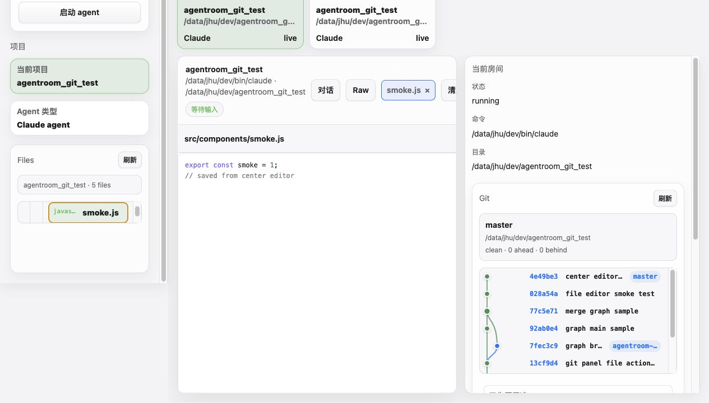
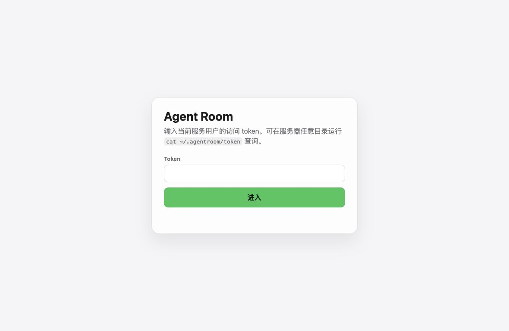
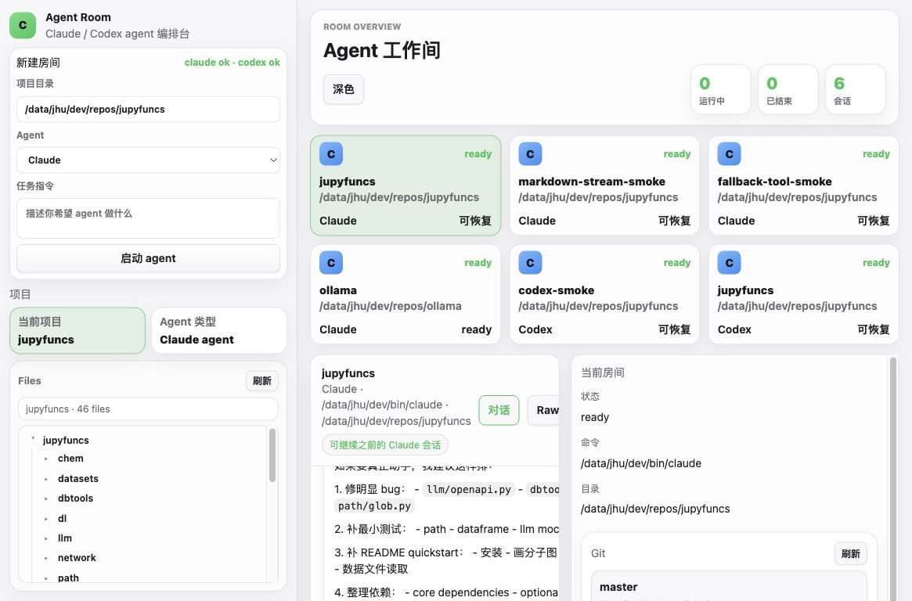

# Agent Room Web Server

Agent Room 是一个运行在目标机器上的 Web 控制台，用来管理 Claude / Codex agent 会话，并提供项目文件管理、代码编辑和 Git 工作区操作。

它适合部署在已经安装好 `claude`、`codex` 的 Linux 机器上，通过浏览器访问该机器的端口。

## 界面预览

主界面：



Token 登录页：



左侧 Files 面板：



## 快速启动

进入 Web Server 目录：

```bash
cd web
bash dev.sh
```

默认监听：

```text
http://localhost:3766
```

远端机器运行后，浏览器打开：

```text
http://<远端 IP>:3766
```

## 登录

Web Server 默认启用 token 登录。启动服务的 Linux 用户可以在任意目录查看 token：

```bash
cat ~/.agentroom/token
```

如果知道服务目录，也可以运行：

```bash
python3 /home/jhu/dev/repos/agentroom/server.py token
```

认证相关文件：

```text
~/.agentroom/token
~/.agentroom/session_secret
```

这两个文件会自动生成，权限为当前启动用户可读写。Web Server 不验证 Linux 密码，只验证 token；能读取启动用户 `~/.agentroom/token` 的用户才能登录。

页面右上角有 `登出` 按钮，会清除登录 cookie 并返回登录页。

## Claude / Codex 命令查找

启动时会按以下顺序查找 CLI：

1. `CLAUDE_BIN` / `CODEX_BIN` 环境变量。
2. 当前启动用户的 `~/.local/npm/bin/claude`、`~/.local/npm/bin/codex`。
3. 当前启动用户的 `~/.local/bin/claude`、`~/.local/bin/codex`。
4. `PATH` 里的 `claude`、`codex`。

如果以上位置都找不到，需要显式指定：

```bash
CLAUDE_BIN=/path/to/claude CODEX_BIN=/path/to/codex bash dev.sh
```

## 常用部署方式

前台运行：

```bash
cd /home/jhu/dev/repos/agentroom
PORT=3766 bash dev.sh
```

后台运行：

```bash
cd /home/jhu/dev/repos/agentroom
setsid env \
  PORT=3766 \
  CLAUDE_RUN_TIMEOUT=600 \
  CODEX_RUN_TIMEOUT=120 \
  bash dev.sh > /tmp/agentroom-3766.log 2>&1 < /dev/null &
```

如果 CLI 不在默认路径或 PATH 中：

```bash
cd /home/jhu/dev/repos/agentroom
setsid env \
  CLAUDE_BIN=/home/jhu/.local/npm/bin/claude \
  CODEX_BIN=/home/jhu/.local/npm/bin/codex \
  PORT=3766 \
  CLAUDE_RUN_TIMEOUT=600 \
  CODEX_RUN_TIMEOUT=120 \
  bash dev.sh > /tmp/agentroom-3766.log 2>&1 < /dev/null &
```

查看服务是否监听：

```bash
lsof -nP -iTCP:3766 -sTCP:LISTEN
```

查看日志：

```bash
tail -f /tmp/agentroom-3766.log
```

## 配置项

| 变量 | 默认值 | 说明 |
| --- | --- | --- |
| `PORT` | `3766` | Web 服务监听端口 |
| `CLAUDE_BIN` | 空 | Claude CLI 路径或命令名；为空时按默认顺序查找 |
| `CODEX_BIN` | 空 | Codex CLI 路径或命令名；为空时按默认顺序查找 |
| `CLAUDE_RUN_TIMEOUT` | `600` | Claude 单轮任务超时时间，单位秒 |
| `CODEX_RUN_TIMEOUT` | `600` | Codex 单轮任务超时时间，单位秒 |
| `CLAUDE_MAX_TURNS` | `12` | Claude 单轮最大 turns |
| `CLAUDE_PERMISSION_MODE` | `acceptEdits` | Claude permission mode |
| `AGENTROOM_AUTH_DIR` | `~/.agentroom` | token 和 session secret 保存目录 |
| `AGENTROOM_TOKEN` | 空 | 直接指定登录 token；为空时读取或生成 token 文件 |
| `AGENTROOM_TOKEN_PATH` | `~/.agentroom/token` | token 文件路径 |
| `AGENTROOM_SESSION_SECRET_PATH` | `~/.agentroom/session_secret` | 登录 cookie 签名密钥文件路径 |
| `AGENTROOM_AUTH_MAX_AGE` | `604800` | 登录 cookie 有效期，单位秒 |
| `AGENTROOM_SESSIONS_PATH` | `web/.agentroom_sessions.json` | Agent Room 会话恢复文件 |

同一台机器上跑多个实例时，建议同时设置不同的 `PORT` 和 `AGENTROOM_SESSIONS_PATH`：

```bash
PORT=3767 AGENTROOM_SESSIONS_PATH=/tmp/agentroom-3767-sessions.json bash dev.sh
```

## 界面区域

左侧栏：

- `新建房间`：输入项目目录、选择 Claude 或 Codex、填写初始任务并启动 agent。
- `项目`：显示当前项目和当前 agent 类型。
- `Files`：显示当前项目文件树，支持新建、打开、编辑和拖拽移动文件。

中间工作区：

- `房间卡片`：显示所有会话，点击切换当前会话。
- `对话`：显示结构化的 `System / You / Agent` 消息。
- `Raw`：查看 Claude / Codex CLI 的原始输出，便于排错。
- `文件`：点击 Files 中的文件后，会在中间打开代码编辑器标签页。
- 底部输入框：给当前 agent 继续发送下一条指令。

右侧栏：

- `当前房间`：显示当前会话状态、命令和目录。
- `Git`：显示当前项目 Git 状态、提交图、变更文件和 diff，并提供 stage、commit、fetch、pull、push 操作。

右上角：

- `深色 / 浅色`：切换主题。
- `登出`：清除登录状态并返回登录页。

## 使用教程

### 1. 启动一个 Claude / Codex 房间

1. 在左侧 `项目目录` 输入项目路径，例如 `/home/jhu/dev/repos/demo`。
2. 在 `Agent` 中选择 `Claude` 或 `Codex`。
3. 在 `任务指令` 中输入初始任务。
4. 点击 `启动 agent`。
5. 中间会出现房间卡片和对话窗口，后续消息从底部输入框发送。

同一工作目录已有未结束房间时，再次启动会切换到已有房间，避免误触重复创建。

### 2. 继续对话

1. 点击一个房间卡片。
2. 在底部输入框输入下一条指令。
3. 按 Enter 或点击 `发送`。

如果上一条任务仍在运行，新消息会排队，当前任务完成后自动继续。

### 3. 查看 Raw 输出

点击中间顶部的 `Raw` 标签，可以查看 CLI 原始输出。

适合排查：

- Claude / Codex 是否启动。
- JSON stream 是否异常。
- CLI 是否报错。
- 工具调用是否卡住。

### 4. 文件管理和编辑

1. 左侧 Files 面板会显示当前项目文件树。
2. 点击文件夹可展开并选为当前目标目录。
3. 点击 `新建` 会在当前目标目录创建文件。
4. 点击文件会在中间工作区打开编辑器标签页。
5. 编辑后点击 `保存`。
6. 文件可以拖拽到其它文件夹中移动。

文件读写和移动都限制在当前项目目录内。

### 5. Git 工作区操作

1. 选择一个 Git 仓库目录作为项目目录。
2. 右侧 Git 面板会显示分支、HEAD、ahead/behind 和变更文件。
3. 点击变更文件查看 diff。
4. 使用 `Stage file` / `Unstage file` 处理单文件。
5. 使用 `Stage all` / `Unstage all` 处理全部变更。
6. 输入提交信息后点击 `Commit`。
7. 可使用 `Fetch`、`Pull --ff-only`、`Push` 与远端同步。

Git graph 是 SVG 分支图，提交行可点击查看对应提交。

### 6. 恢复历史会话

会话元数据会保存到：

```text
web/.agentroom_sessions.json
```

服务重启后，历史房间会以 `ready` 状态恢复。Claude / Codex 的 provider session/thread id 会保留，后续发送消息时会尝试继续原会话。

## 排错

### 页面提示需要登录

查看 token：

```bash
cat ~/.agentroom/token
```

如果 token 文件不存在，启动一次服务会自动生成。

### 页面找不到 Claude 或 Codex

先在服务用户下检查：

```bash
which claude
which codex
ls -l ~/.local/npm/bin/claude ~/.local/npm/bin/codex
```

如果不在默认位置，启动时指定：

```bash
CLAUDE_BIN=/path/to/claude CODEX_BIN=/path/to/codex bash dev.sh
```

### 外映端口不是最新页面

确认实际监听进程目录：

```bash
pid=$(lsof -tiTCP:3766 -sTCP:LISTEN)
pwdx "$pid"
```

静态资源已经设置 `Cache-Control: no-store`。如果浏览器仍显示旧页面，强制刷新一次。

### 端口被占用

```bash
lsof -nP -iTCP:3766 -sTCP:LISTEN
```

换端口启动：

```bash
PORT=3767 bash dev.sh
```

### Git 面板显示不是 Git 仓库

确认项目目录是 Git 仓库：

```bash
cd /path/to/project
git rev-parse --show-toplevel
```

### 文件打不开或保存失败

Web 编辑器只处理文本文件，并限制单文件大小不超过 1MB。二进制文件或过大的文件不会在编辑器中打开。
